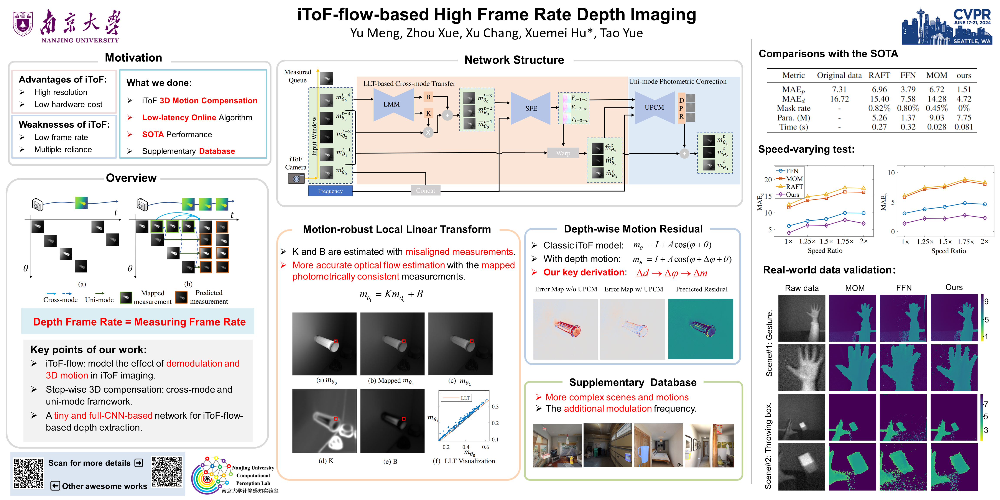

# iToF-flow-based High Frame Rate Depth Imaging
## Introduction
This project is the implement of [iToF-flow-based High Frame Rate Depth Imaging](https://openaccess.thecvf.com/content/CVPR2024/papers/Meng_iToF-flow-based_High_Frame_Rate_Depth_Imaging_CVPR_2024_paper.pdf). 

More details about this work can be found in our [homepage](https://computationalperceptionlab.github.io/publications/assert/project_MengYu/iToF-flow.html). 

### CVPR2024 Poster:



## Usage

### Installation

The `requirements.txt` can be found in our project. 

```cmd
pip3 install -r requirements.txt
```

### Docker deployment 

The docker-based deployment approach is more reliable. The docker image  can be obtained by  [docker download](https://box.nju.edu.cn/d/88065a3013e54ac5a3d2/). 

```cmd
docker load -i tof_flow.tar
docker run -it -v /your warkpath/:/your warkpath/  --gpus all  --shm-size=48g 1835a89e3bb
```

## Evaluation

The   [pre-trained weight](https://box.nju.edu.cn/f/e1f361dda90a499999f9/) and  [evaluation demo data](https://box.nju.edu.cn/f/00e21c3ef90d4df0837d/) should be downloaded.

A demo is provided to demonstrate our approach. A visualization result will be saved to the `./evl_ours_visualization`
```
python eval_demo.py
```

The Evaluation data can be replaced to any other iToF measurements by changing the data path in `./val_data/evl_data.json`


## Dataset

The dataset used in our work is consisted of two parts [Cornell-Box Dataset](https://github.com/schellmi42/WFlowToF) and our extension dataset.

The `Cornell-Box Dataset` can be obtained in [Cornell-Box Dataset](https://github.com/schellmi42/WFlowToF).

Our extension dataset will be available publicly after some procedures required in the data security policy. For the urgent needs, you can email me `mengyu@smail.nju.edu.cn`.

For each set of motion data, we use a `json` file to record the path of corresponding iToF measurements at each moment. The `./make_traing_data/make_traing_data_LLT_SF_json.py` gives a demo for making the`json`. sequence for training and testing.

## Training 

Our method is trained on 3× `RTX 2080` with `torch.distributed`.

```cmd
python3 -m torch.distributed.launch --nproc_per_node=3 train_tof_cvpr_SF.py --world_size=3 --batch_size 8 --epoch 60
```


## Citation

If you think this project is helpful, please feel free to leave a star or cite our paper:

```
@InProceedings{Meng_2024_CVPR,
    author    = {Meng, Yu and Xue, Zhou and Chang, Xu and Hu, Xuemei and Yue, Tao},
    title     = {iToF-flow-based High Frame Rate Depth Imaging},
    booktitle = {Proceedings of the IEEE/CVF Conference on Computer Vision and Pattern Recognition (CVPR)},
    month     = {June},
    year      = {2024},
    pages     = {4929-4938}
}
```

##### **For any questions about the code and paper, please feel free to contact me `mengyu@smail.nju.edu.cn`.**
